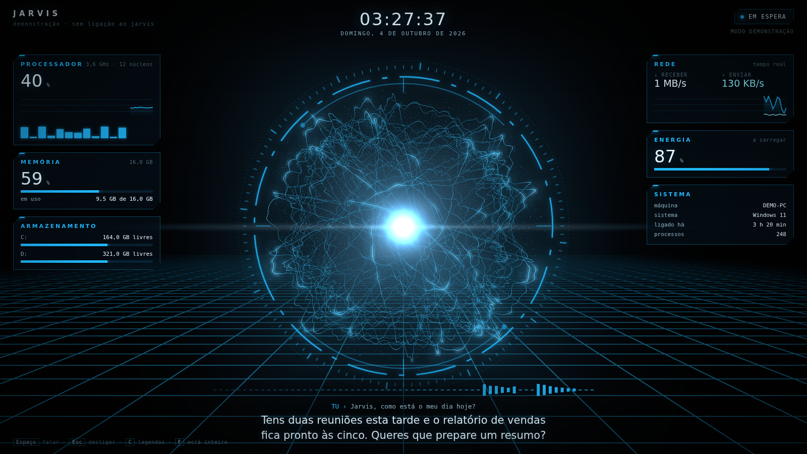
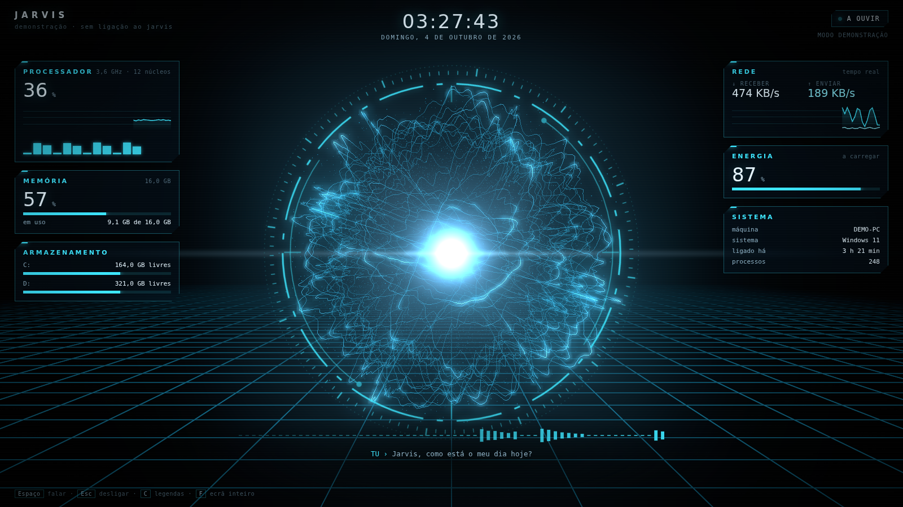
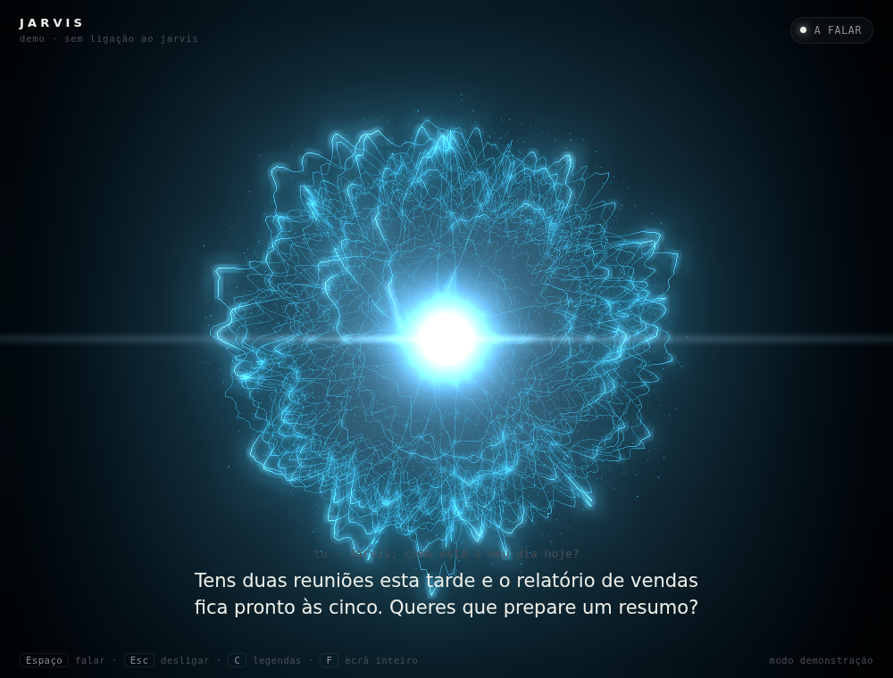

# Jarvis Kit: orbe, voz e persona para o Personal Jarvis

Este kit instala o [Personal Jarvis](https://github.com/PersonalJarvis/PersonalJarvis), um assistente de IA open-source para Windows, macOS e Linux. Por cima dele acrescenta três coisas:

1. **Um orbe de energia** animado que reage em tempo real. Acorda quando dizes "Hey Jarvis", reage à tua voz e pulsa ao ritmo da voz dele.
2. **Uma voz**: Gemini "Charon", grave, calma e formal. É grátis com uma chave Gemini. Em alternativa podes usar ElevenLabs "Daniel", uma voz britânica.
3. **A persona**: o nome "Jarvis", a palavra de ativação "Hey Jarvis" e o reconhecimento de voz em português.

| Em espera | A ouvir | A pensar | A falar |
|---|---|---|---|
|  |  |  |  |

---

## Instalação

**Requisitos:** um computador com Windows 10/11, macOS ou Linux, microfone e colunas, e **uma chave de API**. A mais fácil é a do Gemini, que é gratuita e se cria em <https://aistudio.google.com/apikey>. Não é preciso placa gráfica.

> **Já tens o Personal Jarvis instalado?** Usa o mesmo comando. O kit deteta a instalação, salta o instalador oficial e mantém a tua palavra de ativação e o nome do assistente (por exemplo, "Medusa"). Só acrescenta o orbe e a voz. Para forçar a reinstalação do Jarvis, acrescenta `-Reinstall` no Windows ou `REINSTALL=1` no macOS/Linux.
>
> **Porque é que não consigo falar com ele?** Se só configuraste uma chave da Anthropic (Claude), o Jarvis consegue pensar mas não ouve nem fala, porque a Anthropic não tem modelos de voz. O kit põe o Gemini a tratar das duas coisas: o reconhecimento de voz e a voz. Basta acrescentares a chave Gemini grátis. O Claude continua a ser o cérebro.

### Windows

Abre o **PowerShell**: carrega na tecla Windows, escreve `powershell` e carrega em Enter. Depois cola este comando e carrega em Enter:

```powershell
irm https://raw.githubusercontent.com/REAL7799/ai-website-cloner-template/claude/trusting-hypatia-mx8m91/jarvis-kit/get.ps1 | iex
```

O comando faz tudo por esta ordem:
1. Descarrega o kit para `C:\Users\<tu>\jarvis-kit`.
2. Corre o instalador oficial do Personal Jarvis, que instala o Python e o Git se faltarem. Quando ele perguntar alguma coisa, aceita.
3. Quando a app do Jarvis abrir, o script pede para a fechares: clica com o botão direito no ícone junto ao relógio, escolhe **Sair** e carrega em Enter no PowerShell.
4. Aplica a voz e a persona e cria o atalho **Jarvis Face** no ambiente de trabalho.

### macOS / Linux

Abre o **Terminal**, cola isto e carrega em Enter:

```bash
curl -fsSL https://raw.githubusercontent.com/REAL7799/ai-website-cloner-template/claude/trusting-hypatia-mx8m91/jarvis-kit/get.sh | bash
```

O kit fica em `~/jarvis-kit`. Os passos são os mesmos do Windows, mas o orbe abre-se com `~/jarvis-kit/start-face.sh`.

### Instalação manual (sem o comando de uma linha)

Descarrega o ZIP do repositório no GitHub (botão **Code › Download ZIP**, no ramo `claude/trusting-hypatia-mx8m91`) e extrai a pasta `jarvis-kit`. No Windows, corre `powershell -ExecutionPolicy Bypass -File .\install-windows.ps1` dentro dela; no macOS e no Linux, corre `./install-mac-linux.sh`.

### Depois da instalação (só da primeira vez)

1. Abre o **Personal Jarvis**. Se o assistente inicial pedir uma palavra de ativação, escreve `Hey Jarvis`.
2. Vai a **Settings › API Keys** e cola a chave Gemini. Fica guardada no gestor de credenciais do sistema e não vai para nenhum ficheiro.
3. Abre o orbe. No Windows é o atalho **Jarvis Face**; no macOS e no Linux é `./start-face.sh`.
4. Diz **"Hey Jarvis"** e faz um pedido, por exemplo: *"Planeia comigo o dia de amanhã."*

---

## O orbe

O orbe é uma esfera de plasma desenhada em tempo real no browser com WebGL. Tem dezenas de anéis de luz distorcidos por ruído, poeira luminosa por dentro, um núcleo incandescente e um reflexo horizontal de lente. Cada estado do Jarvis tem um comportamento próprio:

| Estado | O que acontece |
|---|---|
| **Em espera** | Azul elétrico. Ondula devagar, respira e roda lentamente. |
| **A ouvir** | Fica ciano e agita-se ao ritmo da **tua** voz. |
| **A pensar** | Fica violeta-azulado e mais turbulento, com o plasma a girar depressa. |
| **A falar** | Pulsa com o **volume real** da voz do Jarvis: os anéis expandem-se, o núcleo cresce e o reflexo alonga-se. As legendas mostram o que ele diz. |
| **Offline** | Pequeno, escuro e quase parado, à espera de que a app arranque. |
| **Erro** | Fica vermelho e instável. |

Mexer o rato inclina o orbe na direção do ponteiro. Se o sistema tiver a opção "reduzir movimento" ativa, a animação fica mais calma.

**Controlos:** clicar no orbe ou carregar em `Espaço` começa ou termina a conversa. `Esc` desliga, `C` mostra ou esconde as legendas e `F` põe em ecrã inteiro.

Para ver o orbe sem ter o Jarvis instalado, abre `face/face.html` diretamente no browser. Entra em **modo demonstração**. Precisas de um browser com WebGL (Chrome, Edge, Firefox ou Safari atuais).

### Como funciona

```
Personal Jarvis (app)  ──/ws (estado, níveis de áudio, texto)──▶  face_bridge.py  ──▶  face.html (orbe)
   127.0.0.1:47821     ◀──POST /api/voice/call · /hangup──────      127.0.0.1:47900
```

O Jarvis recusa ligações de páginas web de outras origens, e isso é uma proteção de segurança. Por isso o `face_bridge.py` liga-se a ele como cliente local, tal como as ferramentas do próprio Jarvis, e serve o orbe. A ponte usa o Python já instalado com o Jarvis, por isso não tens de instalar mais nada. Tudo fica no teu computador (`127.0.0.1`) e nada sai para a internet.

---

## Mudar a voz

```bash
# lista as vozes recomendadas
~/.personal-jarvis/.venv/bin/python configure_jarvis.py --list-voices

# outra voz do Gemini
~/.personal-jarvis/.venv/bin/python configure_jarvis.py --voice Orus

# ElevenLabs (é preciso ELEVENLABS_API_KEY em Settings › API Keys)
~/.personal-jarvis/.venv/bin/python configure_jarvis.py --tts elevenlabs
~/.personal-jarvis/.venv/bin/python configure_jarvis.py --tts elevenlabs --voice <voice_id>
```

No Windows, troca o caminho por `%USERPROFILE%\.personal-jarvis\.venv\Scripts\python.exe`. Reinicia o Jarvis depois de cada mudança. O script faz sempre uma cópia de segurança do `jarvis.toml` antes de o alterar, e `--dry-run` mostra o resultado sem gravar nada.

Também podes mudar a voz nas definições de voz da app.

### O que o `configure_jarvis.py` altera

| Definição | Valor | Porquê |
|---|---|---|
| `[trigger.wake_word] phrase` | mantém a atual (`Hey Jarvis` numa instalação nova) | O nome do assistente vem da palavra de ativação, por isso o kit não a altera. |
| `[stt] provider / language` | `gemini-api` / `pt` | Ouve-te com a mesma chave Gemini da voz e reconhece melhor o português. |
| `[brain] reply_language` | `auto`, se ainda não estiver definido | Responde na língua em que falas (ver limitação abaixo). |
| `[tts] provider / voice` | `gemini-flash-tts` / `Charon` | Voz grave e formal, grátis com a chave Gemini. |
| `[ui] orb_style` | não muda | Só muda com `--overlay none`, se quiseres esconder a barra do Jarvis e ficar só com o orbe. |

## Limitações

- **Português:** o Jarvis só tem modo fixo para alemão, inglês e espanhol. Em português funciona no modo `auto`: quando lhe falas em português, ele responde em português. Às vezes pode escapar uma frase noutra língua. Se isso acontecer, diz-lhe *"responde sempre em português"*.
- **Palavra de ativação:** não existe um modelo pré-treinado para "Hey Jarvis". A deteção usa reconhecimento genérico (Vosk ou Whisper). Em ambientes com muito ruído podes usar o atalho de teclado da app ou clicar no orbe.
- **Custos:** a chave Gemini tem um nível gratuito com limites. O ElevenLabs e outros fornecedores cobram à parte.

## Resolução de problemas

| Sintoma | Solução |
|---|---|
| O orbe diz "à espera do Jarvis" | Abre a app Personal Jarvis. O orbe liga-se sozinho em poucos segundos. |
| O orbe diz "ponte desligada" | Volta a abrir o atalho Jarvis Face ou o `start-face.sh`. No macOS/Linux o registo fica em `/tmp/jarvis-face.log`. |
| Fala mas o orbe não pulsa | Atualiza o Jarvis, voltando a correr o instalador. As versões antigas não enviam o nível de áudio. |
| Não ouve "Hey Jarvis" | Confirma nas definições da app qual é o microfone escolhido e qual é a palavra de ativação. |
| A app pede uma "Control Key" | Ativaste o bloqueio do browser. Define `JARVIS_CONTROL_KEY` com a chave mostrada em Settings antes de abrir o orbe. |

## Ficheiros

```
jarvis-kit/
├── get.ps1 / get.sh        instalação de uma linha (descarrega o kit e corre o instalador)
├── install-windows.ps1     instala o Jarvis + persona + atalho
├── install-mac-linux.sh    instala o Jarvis + persona
├── configure_jarvis.py     voz, persona e palavra de ativação (com cópia de segurança)
├── start-face.bat / .sh    arranca a ponte e abre o orbe numa janela
└── face/
    ├── face_bridge.py      ponte local Jarvis ⇄ orbe
    ├── face.html           interface
    ├── orb.js              orbe já compilado (three.js incluído)
    └── source/             código-fonte do orbe
        ├── src/orb.js      anéis de plasma, núcleo, reflexo e animação
        ├── src/hud.js      ligação à ponte, legendas, teclas, modo demo
        └── build.mjs
```

### Alterar o orbe

O `orb.js` já vem compilado, por isso só precisas de Node.js se quiseres mudar o código:

```bash
cd jarvis-kit/face/source
npm install
npm run build   # src/ -> ../orb.js
```

As cores, a turbulência, o tamanho e o brilho de cada estado estão na tabela `LOOK` no início de `src/orb.js`. `RINGS` controla quantos anéis de luz tem o orbe.

## Créditos

- Renderização: [three.js](https://threejs.org) (licença MIT).
- Ruído simplex 3D: Ashima Arts / Stefan Gustavson (licença MIT).
