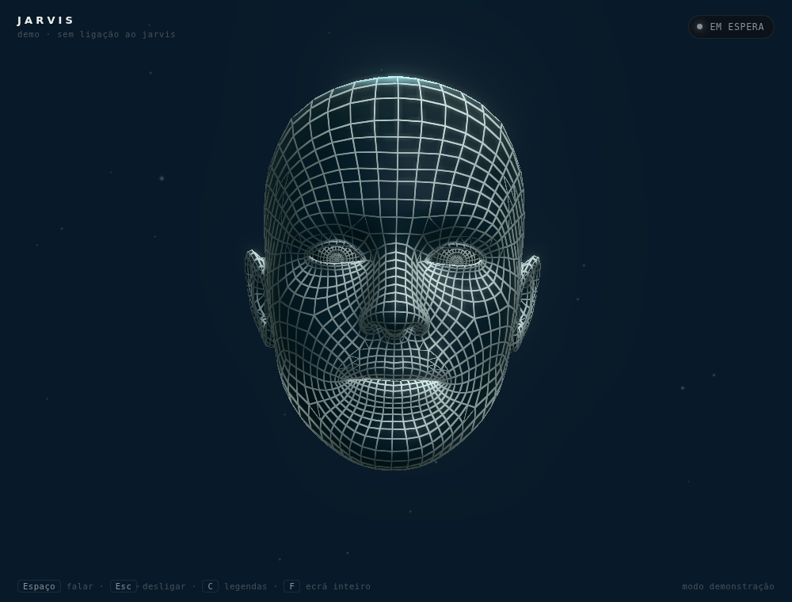
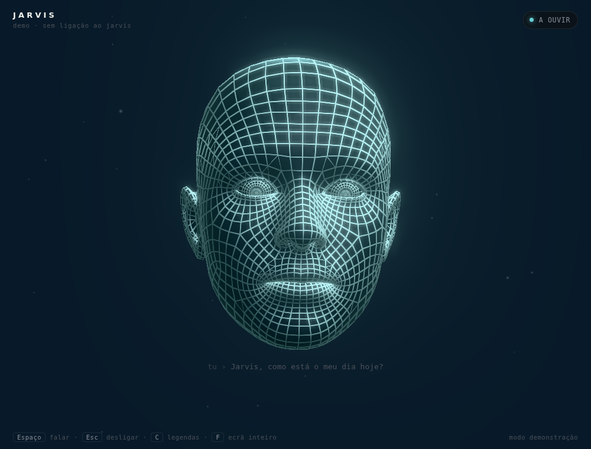
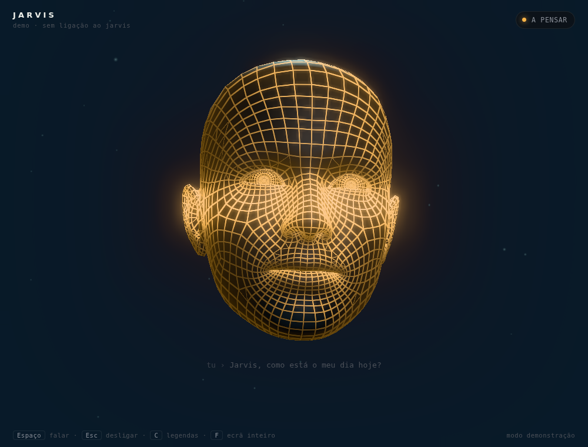
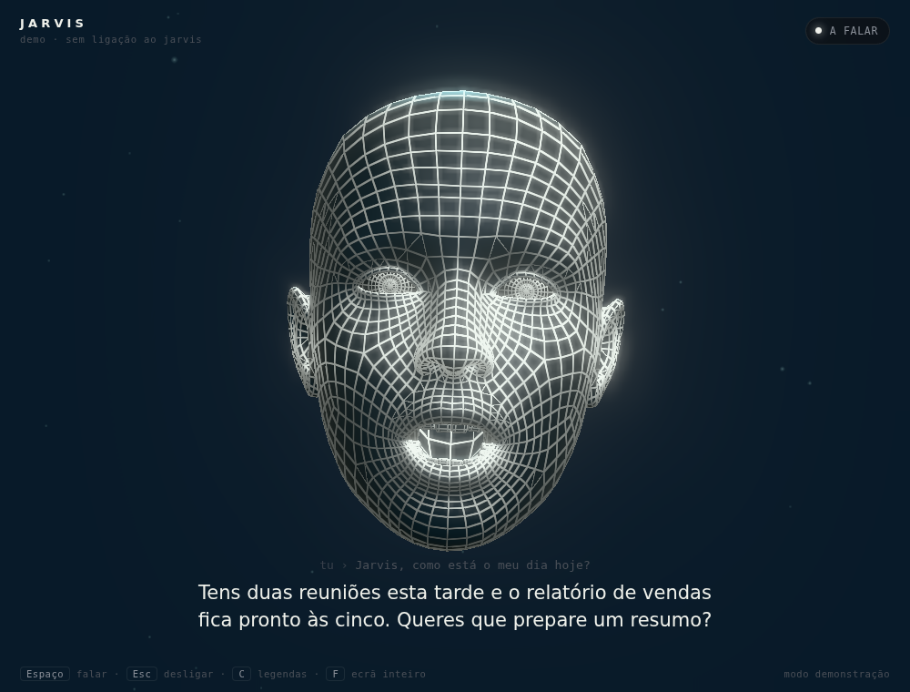

# Jarvis Kit: rosto, voz e persona para o Personal Jarvis

Este kit instala o [Personal Jarvis](https://github.com/PersonalJarvis/PersonalJarvis), um assistente de IA open-source para Windows, macOS e Linux. Por cima dele acrescenta três coisas:

1. **Um rosto animado** que reage em tempo real. Acorda quando dizes "Hey Jarvis", ouve-te e mexe a boca ao ritmo da voz dele.
2. **Uma voz**: Gemini "Charon", grave, calma e formal. É grátis com uma chave Gemini. Em alternativa podes usar ElevenLabs "Daniel", uma voz britânica.
3. **A persona**: o nome "Jarvis", a palavra de ativação "Hey Jarvis" e o reconhecimento de voz em português.

| Em espera | A ouvir | A pensar | A falar |
|---|---|---|---|
|  |  |  |  |

---

## Instalação

**Requisitos:** um computador com Windows 10/11, macOS ou Linux, microfone e colunas, e **uma chave de API**. A mais fácil é a do Gemini, que é gratuita e se cria em <https://aistudio.google.com/apikey>. Não é preciso placa gráfica.

### Windows

1. Descarrega esta pasta `jarvis-kit` para o computador.
2. Clica com o botão direito em `install-windows.ps1` e escolhe **Executar com o PowerShell**. Em alternativa, abre o PowerShell dentro da pasta e corre:
   ```powershell
   powershell -ExecutionPolicy Bypass -File .\install-windows.ps1
   ```
3. O instalador oficial do Jarvis instala o Python e o Git se faltarem e abre a app. Quando o script pedir, fecha a app e carrega em Enter. O script aplica a voz e a persona e cria o atalho **Jarvis Face** no ambiente de trabalho.

### macOS / Linux

```bash
cd jarvis-kit
./install-mac-linux.sh
```

### Depois da instalação (só da primeira vez)

1. Abre o **Personal Jarvis**. Se o assistente inicial pedir uma palavra de ativação, escreve `Hey Jarvis`.
2. Vai a **Settings › API Keys** e cola a chave Gemini. Fica guardada no gestor de credenciais do sistema e não vai para nenhum ficheiro.
3. Abre o rosto. No Windows é o atalho **Jarvis Face**; no macOS e no Linux é `./start-face.sh`.
4. Diz **"Hey Jarvis"** e faz um pedido, por exemplo: *"Planeia comigo o dia de amanhã."*

---

## O rosto

O rosto é uma cabeça humana 3D com uma malha em grelha luminosa, desenhada em tempo real no browser com WebGL. Tem 52 expressões faciais: a boca abre, os olhos piscam e seguem o rato, e as sobrancelhas mexem-se. Cada estado do Jarvis tem um comportamento próprio:

| Estado | O que acontece |
|---|---|
| **Em espera** | Grelha branca-azulada. Respira, pisca, olha à volta e esboça um leve sorriso. |
| **A ouvir** | Fica ciano, os olhos abrem-se e as sobrancelhas sobem. A grelha brilha mais quando **tu** falas. |
| **A pensar** | Fica âmbar, franze a testa e semicerra os olhos. Os olhos varrem de um lado para o outro e uma linha de luz percorre a cabeça. |
| **A falar** | O maxilar abre com o **volume real** da voz do Jarvis e os dentes ficam à vista. Os lábios alternam entre forma redonda e esticada, a cabeça acena ligeiramente e as legendas mostram o que ele diz. |
| **Offline** | Olhos fechados e cabeça descaída, à espera de que a app arranque. |

**Controlos:** clicar no rosto ou carregar em `Espaço` começa ou termina a conversa. `Esc` desliga, `C` mostra ou esconde as legendas e `F` põe em ecrã inteiro.

Para ver o rosto sem ter o Jarvis instalado, abre `face/face.html` diretamente no browser. Entra em **modo demonstração**. Precisas de um browser com WebGL (Chrome, Edge, Firefox ou Safari atuais).

### Como funciona

```
Personal Jarvis (app)  ──/ws (estado, níveis de áudio, texto)──▶  face_bridge.py  ──▶  face.html
   127.0.0.1:47821     ◀──POST /api/voice/call · /hangup──────      127.0.0.1:47900
```

O Jarvis recusa ligações de páginas web de outras origens, e isso é uma proteção de segurança. Por isso o `face_bridge.py` liga-se a ele como cliente local, tal como as ferramentas do próprio Jarvis, e serve o rosto. A ponte usa o Python já instalado com o Jarvis, por isso não tens de instalar mais nada. Tudo fica no teu computador (`127.0.0.1`) e nada sai para a internet.

---

## Mudar a voz

```bash
# lista as vozes recomendadas
~/.personal-jarvis/.venv/bin/python configure_jarvis.py --list-voices

# outra voz do Gemini
~/.personal-jarvis/.venv/bin/python configure_jarvis.py --voice Orus

# ElevenLabs (é preciso ELEVENLABS_API_KEY em Settings › API Keys)
~/.personal-jarvis/.venv/bin/python configure_jarvis.py --tts elevenlabs
~/.personal-jarvis/.venv/bin/python configure_jarvis.py --tts elevenlabs --voice <voice_id>
```

No Windows, troca o caminho por `%USERPROFILE%\.personal-jarvis\.venv\Scripts\python.exe`. Reinicia o Jarvis depois de cada mudança. O script faz sempre uma cópia de segurança do `jarvis.toml` antes de o alterar, e `--dry-run` mostra o resultado sem gravar nada.

Também podes mudar a voz nas definições de voz da app.

### O que o `configure_jarvis.py` altera

| Definição | Valor | Porquê |
|---|---|---|
| `[trigger.wake_word] phrase` | `Hey Jarvis` | O Jarvis tira o nome da palavra de ativação. |
| `[stt] language` | `pt` | Melhora o reconhecimento de português. |
| `[brain] reply_language` | `auto` | Responde na língua em que falas (ver limitação abaixo). |
| `[tts] provider / voice` | `gemini-flash-tts` / `Charon` | Voz grave e formal, grátis com a chave Gemini. |
| `[ui] orb_style` | não muda | Só muda com `--overlay none`, se quiseres esconder a barra do Jarvis e ficar só com o rosto. |

## Limitações

- **Português:** o Jarvis só tem modo fixo para alemão, inglês e espanhol. Em português funciona no modo `auto`: quando lhe falas em português, ele responde em português. Às vezes pode escapar uma frase noutra língua. Se isso acontecer, diz-lhe *"responde sempre em português"*.
- **Palavra de ativação:** não existe um modelo pré-treinado para "Hey Jarvis". A deteção usa reconhecimento genérico (Vosk ou Whisper). Em ambientes com muito ruído podes usar o atalho de teclado da app ou clicar no rosto.
- **Custos:** a chave Gemini tem um nível gratuito com limites. O ElevenLabs e outros fornecedores cobram à parte.

## Resolução de problemas

| Sintoma | Solução |
|---|---|
| O rosto diz "à espera do Jarvis" | Abre a app Personal Jarvis. O rosto liga-se sozinho em poucos segundos. |
| O rosto diz "ponte desligada" | Volta a abrir o atalho Jarvis Face ou o `start-face.sh`. No macOS/Linux o registo fica em `/tmp/jarvis-face.log`. |
| Fala mas a boca não mexe | Atualiza o Jarvis, voltando a correr o instalador. As versões antigas não enviam o nível de áudio. |
| Não ouve "Hey Jarvis" | Confirma nas definições da app qual é o microfone escolhido e qual é a palavra de ativação. |
| A app pede uma "Control Key" | Ativaste o bloqueio do browser. Define `JARVIS_CONTROL_KEY` com a chave mostrada em Settings antes de abrir o rosto. |

## Ficheiros

```
jarvis-kit/
├── install-windows.ps1     instala o Jarvis + persona + atalho
├── install-mac-linux.sh    instala o Jarvis + persona
├── configure_jarvis.py     voz, persona e palavra de ativação (com cópia de segurança)
├── start-face.bat / .sh    arranca a ponte e abre o rosto numa janela
└── face/
    ├── face_bridge.py      ponte local Jarvis ⇄ rosto
    ├── face.html           interface
    ├── face3d.js           rosto 3D já compilado (three.js + modelo embutido)
    ├── head.glb            modelo da cabeça preparado (sem texturas)
    └── source/             código-fonte do rosto 3D
        ├── src/face3d.js   malha, iluminação, expressões e animação
        ├── src/hud.js      ligação à ponte, legendas, teclas, modo demo
        ├── prepare-model.mjs
        └── build.mjs
```

### Alterar o rosto 3D

O `face3d.js` já vem compilado, por isso só precisas de Node.js se quiseres mudar o código:

```bash
cd jarvis-kit/face/source
npm install
npm run model   # só se mudares o modelo: facecap.source.glb -> ../head.glb
npm run build   # src/ -> ../face3d.js
```

As cores, o brilho e a expressão de cada estado estão na tabela `LOOK` no início de `src/face3d.js`.

## Créditos

- Modelo da cabeça: **Face Cap**, de [Bannaflak](https://www.bannaflak.com/face-cap), tal como é distribuído nos exemplos do [three.js](https://github.com/mrdoob/three.js/tree/dev/examples/models/gltf). Não encontrei uma licença explícita para este modelo. Serve bem para uso pessoal; para uso comercial, confirma a licença com o autor ou troca o modelo por outro com blendshapes ARKit.
- Renderização: [three.js](https://threejs.org) (licença MIT).
